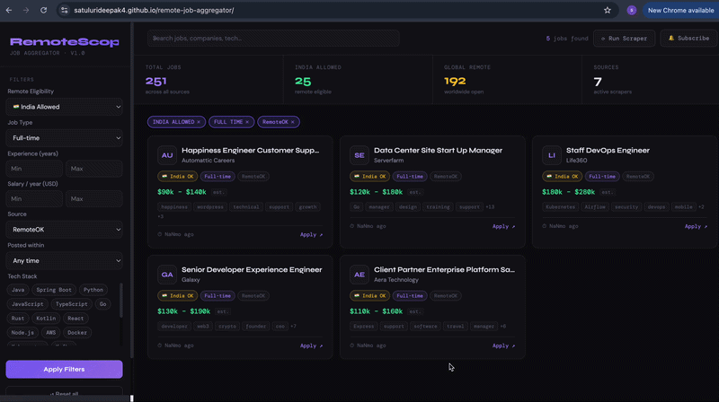

<div align="center">

# 🌐 **[RemoteScope](https://satulurideepak4.github.io/remote-job-aggregator/)**

### Remote Job Aggregator — Java 17 · Spring Boot · PostgreSQL

Automatically collects remote software jobs from **13 sources every day**, removes duplicates,
and lets you search them through a clean API and dashboard.

**Goal:** Find full-time remote roles ≥ $70K that hire from India — without checking 13 websites manually.

[](https://openjdk.org/projects/jdk/17/)
[](https://spring.io/projects/spring-boot)
[](https://www.postgresql.org/)
[](https://www.docker.com/)
[](LICENSE)

</div>
<div align="center">
  
</div>

## What it does

Every morning at 6 AM, RemoteScope:

1. **Fetches** jobs from 13 sources — job board APIs and web scrapers
2. **Cleans** the data — strips HTML, parses salary ranges, extracts tech keywords
3. **Deduplicates** — same job from two sources is stored only once
4. **Stores** everything in PostgreSQL with smart indexes for fast search
5. **Serves** a REST API and dashboard so you can filter exactly what you need

---

## How it works — System Flow

```
  ┌────────────────────────────────────────────────────────────┐
  │              TRIGGER                                        │
  │   Runs automatically at 6 AM  ·  or manually via API       │
  └──────────────────────┬─────────────────────────────────────┘
                         │
          ┌──────────────┴──────────────┐
          ▼                             ▼
  ┌───────────────────┐       ┌──────────────────────┐
  │   5 API CLIENTS   │       │    8 WEB SCRAPERS    │
  │   (JSON APIs)     │       │    (HTML parsing)    │
  │                   │       │                      │
  │  • Remotive       │       │  • WeWorkRemotely    │
  │  • RemoteOK       │       │  • Himalayas         │
  │  • Arbeitnow      │       │  • Arc.dev           │
  │                   │       │  • JustRemote        │
  │  All free,        │       │  • NoDesk            │
  │  no key needed    │       │  • DailyRemote       │
  │                   │       │  • Wellfound         │
  └────────┬──────────┘       │  • Jobgether         │
           │                  └──────────┬───────────┘
           └──────────────┬──────────────┘
                          ▼
  ┌─────────────────────────────────────────────────────────┐
  │                 PROCESSING PIPELINE                      │
  │                                                          │
  │  Step 1 · JobNormalizer                                  │
  │           Cleans HTML, parses experience range,          │
  │           detects remote eligibility (India/Global)      │
  │                                                          │
  │  Step 2 · TechStackExtractor                             │
  │           Scans description for 80+ keywords             │
  │           (Java, Kafka, Docker ...) → stores as array    │
  │                                                          │
  │  Step 3 · SalaryEstimator                                │
  │           If salary is missing, estimates based          │
  │           on job title (Senior/Junior/Lead etc.)         │
  │                                                          │
  │  Step 4 · Deduplication                                  │
  │           SHA-256 hash of title + company + source       │
  │           Same job from two sources → stored once        │
  └──────────────────────────┬──────────────────────────────┘
                             ▼
  ┌──────────────────────────────────────────────────────────┐
  │                     PostgreSQL                           │
  │                                                          │
  │  • GIN index on tech_stack[]  → fast array search       │
  │  • Partial index for India + $70k roles                  │
  │  • scrape_runs table logs every run for debugging        │
  └──────────────────────────┬───────────────────────────────┘
                             ▼
  ┌──────────────────────────────────────────────────────────┐
  │          JobQueryService  (results cached 5 min)         │
  └──────────┬───────────────────────┬───────────────────────┘
             ▼                       ▼                   ▼
     ┌──────────────┐     ┌────────────────┐    ┌──────────────┐
     │  Dashboard   │     │  REST API      │    │  Email Alert │
     │  index.html  │     │  /api/jobs     │    │  on new jobs │
     │  Dark UI     │     │  + filters     │    │              │
     └──────────────┘     └────────────────┘    └──────────────┘
```

---

## Quick Start

### Option A — Docker (recommended)

One command starts everything: PostgreSQL + Spring Boot + Nginx dashboard.

```bash
git clone https://github.com/YOUR_USERNAME/remotescope.git
cd remotescope
docker compose up -d
```

| What | URL |
|---|---|
| Dashboard | http://localhost:3000 |
| REST API | http://localhost:8080/api/jobs |
| Swagger docs | http://localhost:8080/swagger-ui.html |

### Option B — Run locally

Requirements: Java 17, Maven, PostgreSQL running locally.

```bash
# 1. Create the database
psql -U postgres -c "CREATE DATABASE remotejobs;"

# 2. Start the app
./mvnw spring-boot:run

# 3. Open frontend/index.html in any browser
```

### Trigger your first scrape

The database is empty on first run. Click **"Run Scraper"** on the dashboard, or:

```bash
curl -X POST http://localhost:8080/api/admin/trigger
```

This runs all 13 sources and takes about 3–5 minutes. After that, the scheduler runs automatically every day at 6 AM — no action needed.

---

## Job Sources

### Free API clients — reliable, no configuration needed

| Source | What it provides |
|---|---|
| **Remotive** | 100 remote jobs per call, global roles |
| **RemoteOK** | High volume, includes salary fields |
| **Arbeitnow** | European and global remote listings |

### Web scrapers — HTML parsing with rate limiting

| Source | Why it's good for India / $70k |
|---|---|
| **WeWorkRemotely** | Large tech & startup board, global roles |
| **Himalayas** | Every job shows salary, many India-friendly |
| **Arc.dev** | Vetted listings only — consistently $70k+ |
| **JustRemote** | Explicitly shows worldwide eligibility |
| **NoDesk** | Engineering-focused, curated list |
| **DailyRemote** | Refreshed every 24 hours |
| **Wellfound** | Startup roles with global hiring |
| **Jobgether** | Tags jobs as "worldwide" — great India signal |

### Dynamic company career pages

Add any company's career page through the API — no code change required:

```bash
curl -X POST http://localhost:8080/api/admin/company-sources \
  -H "Content-Type: application/json" \
  -d '{
    "companyName": "Stripe",
    "careersUrl": "https://stripe.com/jobs",
    "active": true
  }'
```

---

## REST API

### Search jobs — `GET /api/jobs`

All parameters are optional. Combine them freely.

| Parameter | What it does | Example |
|---|---|---|
| `remoteType` | Filter by eligibility | `INDIA_ALLOWED` · `GLOBAL` |
| `jobType` | Employment type | `FULL_TIME` · `CONTRACT` |
| `expMin` / `expMax` | Years of experience | `3` / `6` |
| `salaryMin` / `salaryMax` | Annual salary in USD | `70000` / `150000` |
| `techStack` | Tech keywords (repeatable) | `techStack=Java&techStack=Kafka` |
| `keyword` | Search title and company | `backend` |
| `source` | Specific job board | `Himalayas` |
| `daysAgo` | How recently posted | `7` |
| `page` / `size` | Pagination | `0` / `20` |

**Example — your personal filter (India, Java, $70k+):**

```bash
curl "http://localhost:8080/api/jobs?remoteType=INDIA_ALLOWED&techStack=Java&techStack=Spring+Boot&salaryMin=70000&jobType=FULL_TIME"
```

**Example — fresh global jobs this week:**

```bash
curl "http://localhost:8080/api/jobs?remoteType=GLOBAL&jobType=FULL_TIME&daysAgo=7"
```

### Admin endpoints

```bash
# Manually trigger all scrapers right now
POST /api/admin/trigger

# Trigger one specific source
POST /api/admin/trigger/Himalayas

# View last 10 scrape run logs
GET  /api/admin/runs

# Manage company career pages
GET    /api/admin/company-sources
POST   /api/admin/company-sources
PUT    /api/admin/company-sources/{id}
DELETE /api/admin/company-sources/{id}
```

### Notification subscriptions

```bash
# Subscribe for email alerts when new jobs are found
curl -X POST http://localhost:8080/api/subscriptions \
  -H "Content-Type: application/json" \
  -d '{"channel":"EMAIL","destination":"you@gmail.com"}'
```

---

## Configuration

All settings live in `src/main/resources/application.yml`.

### Email notifications

To receive an email when new jobs are scraped:

```yaml
notification:
  email:
    enabled: true
    recipient: you@gmail.com

spring:
  mail:
    host: smtp.gmail.com
    username: you@gmail.com
    password: your-gmail-app-password  # Generate at myaccount.google.com/apppasswords
```

### Scheduler timing

```yaml
scheduler:
  cron: "0 0 6 * * *"   # Runs at 6 AM every day
  enabled: true
```

---

## Project Structure

```
remote-job-aggregator/
│
├── src/main/java/com/remotejobs/
│   │
│   ├── controller/              REST endpoints
│   │   ├── JobController        GET /api/jobs with all filters
│   │   ├── AdminController      trigger scrapes, manage sources
│   │   └── SubscriptionController  email alert signup
│   │
│   ├── service/
│   │   ├── api/                 5 API clients (Remotive, RemoteOK...)
│   │   ├── scraper/             8 web scrapers + company career pages
│   │   └── impl/
│   │       ├── JobIngestionService   runs all sources, saves results
│   │       └── JobQueryService       filtered search with caching
│   │
│   ├── util/
│   │   ├── JobNormalizer        cleans raw data into unified format
│   │   ├── TechStackExtractor   finds tech keywords in descriptions
│   │   └── SalaryEstimator      estimates salary when not listed
│   │
│   ├── entity/                  Job · ScrapeRun · CompanySource · Subscription
│   ├── repository/              JobRepository · JobSpecification (dynamic filters)
│   ├── scheduler/               daily cron + manual trigger
│   └── notification/            email alerts on new jobs
│
├── src/main/resources/
│   ├── application.yml          all configuration
│   └── db/migration/
│       ├── V1__initial_schema.sql    tables + indexes
│       └── V2__india_filter.sql      optimised indexes for India + $70k
│
├── frontend/
│   └── index.html               dashboard — no build tools needed
│
├── docker-compose.yml           PostgreSQL + app + Nginx
└── Dockerfile
```

---

## Database Design

```
jobs
  ├── title, company_name, job_link, description
  ├── job_type      FULL_TIME | CONTRACT | PART_TIME | INTERNSHIP
  ├── remote_type   GLOBAL | INDIA_ALLOWED | REGION_SPECIFIC | UNKNOWN
  ├── experience_min, experience_max
  ├── salary_min, salary_max, salary_currency, salary_estimated
  ├── tech_stack    TEXT[]   ← GIN index — fast keyword search
  ├── source, location, posted_date, scraped_at
  └── hash          SHA-256 unique key — prevents duplicates

scrape_runs     logs every scrape: source, time, jobs found, status
company_sources config for dynamic career pages
subscriptions   email alert targets
```

---

## Common Issues & Fixes

| Error | Cause | Fix |
|---|---|---|
| `missing table [company_sources]` | Flyway files in wrong folder or lowercase `v` prefix | Move files to `db/migration/` and rename `v1__` → `V1__` |
| `could not determine data type` | PostgreSQL can't infer type of NULL params in native SQL | Use `JobSpecification` — builds query dynamically, never sends null params |
| `No property 'posted' found` | `Sort.by("posted_date")` uses column name, not Java field name | Change to `Sort.by("postedDate")` |
| `column "posteddate" does not exist` | Spring appends sort from `Pageable` on top of native query | Pass unsorted `PageRequest` to native queries — let SQL handle `ORDER BY` |
| Dashboard shows "API offline" | Port mismatch between Spring Boot and `index.html` | Match `server.port` in `application.yml` with `API_BASE` in `index.html` |
| Jobs in DB but nothing shown | `NULL >= NULL` is false in PostgreSQL | Wrap nullable columns with `COALESCE` in queries |

---

## Tech Stack

| Layer | Technology | Why |
|---|---|---|
| Language | Java 17 | LTS, records, text blocks |
| Framework | Spring Boot 3.2 | Auto-config, JPA, scheduling built-in |
| Database | PostgreSQL 16 + Flyway | GIN array indexes, versioned migrations |
| HTTP / Scraping | OkHttp + Jsoup | Rate limiting, retry, HTML parsing |
| Dynamic filters | JPA Specifications | No null type issues with PostgreSQL |
| Cache | Caffeine | In-memory, 5 min TTL on search results |
| API Docs | Springdoc OpenAPI | Auto-generated Swagger UI |
| Notifications | Spring Mail | Email alerts on new jobs |
| Frontend | Vanilla HTML/CSS/JS | Zero build tools, runs from file:// |
| Container | Docker + Nginx | One-command setup |

---

## License

MIT — use it, fork it, build on it.

---

<div align="center">
Built to solve a real problem — finding remote jobs that actually hire from India.
</div>
